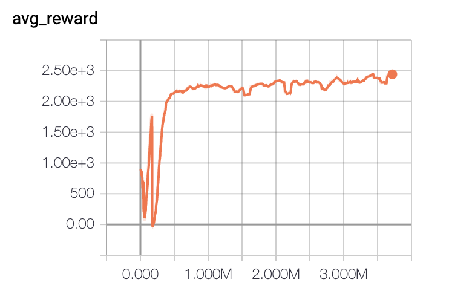

# TD3

[](https://colab.research.google.com/drive/1foJRBKv0ymV7I5cpmQ6bI4v6CyJ-qATs)

An implementation of the TD3 algorithm trained on the Roboschool HalfCheetah environment using pytorch. The code here is based on the work of the original authors of the TD3 algorithm found [here](https://github.com/sfujim/TD3). 


## Getting Started

These instructions will demonstrate how to setup a conda environment with all requirements for the project setup.

### Installing

```
conda env create -n rl_dev python=3.6

conda activate rl_dev

git clone https://github.com/djbyrne/TD3.git

cd TD3

python setup.py install 

jupyter notebook
```

### Results

The notebook uses the same hyperparameters and architecture described in the paper. The agent is trained for 5 million timesteps. The agent converged on a successfull policy after 500k timesteps. The results below show the agents avg score over the previous 100 episodes.

As you can see, the agent learned rapidly and then briefly fell into a local optima. However, the agent was able to quickly recover itself. I believe with hyperparameter tuning and a proper sample of trained agents, the results could still improve. 




## Acknowledgments

* Scott Fujimoto [TD3](https://github.com/sfujim/TD3)
* OpenAI [Spinning Up](https://github.com/openai/spinningup)
* OpenAI [Baselines](https://github.com/openai/baselines)
